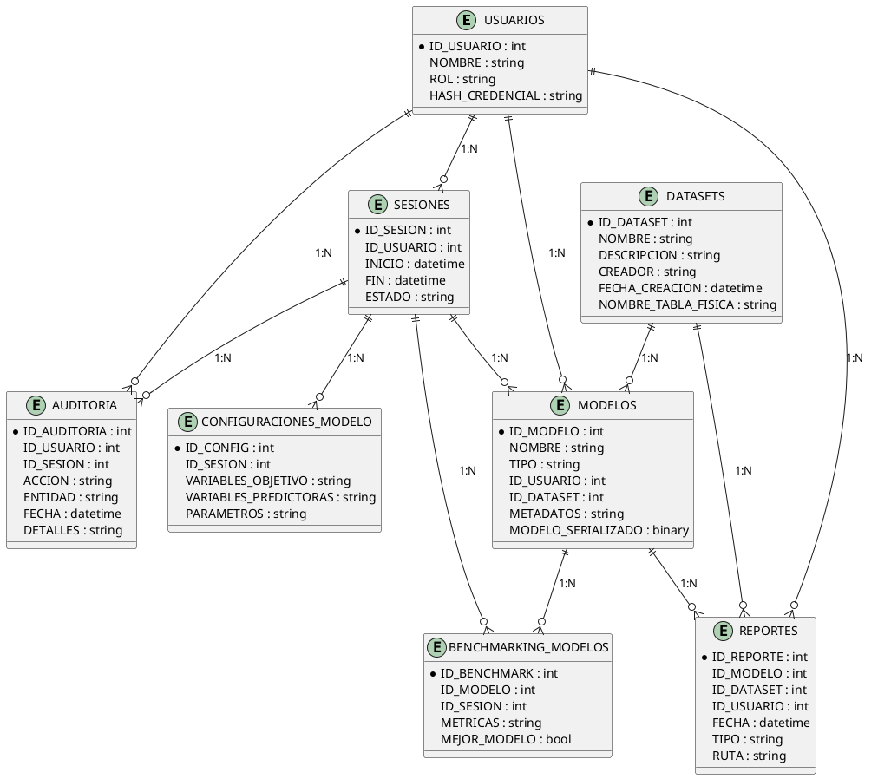

# analitica-farma

Aplicación para analizar datos productivos en la industria farmacéutica y recomendar modelos de machine learning. Permite cargar datos, validarlos, transformarlos, entrenar y comparar modelos, recomendar el mejor y generar reportes completos. Arquitectura modular, multipágina, con integración a Snowflake y logging centralizado.

---

## Tabla de Historias de Usuario Implementadas y Planificadas

| HU   | Descripción breve                                                        | Criterios de aceptación principales                | Archivos/módulos clave                  |
|------|--------------------------------------------------------------------------|---------------------------------------------------|-----------------------------------------|
| HU1  | Carga de datos desde CSV o Snowflake                                     | Importar, validar y almacenar datasets             | src/datos/cargador.py, pages/Datos/01_Cargar_Datos.py |
| HU2  | Configuración del problema y variables                                   | Selección de variable objetivo y predictores       | src/datos/cargador.py, pages/Datos/02_Configurar_Datos.py |
| HU3  | Validación automática de tipos, fechas y unidades                        | Detectar y sugerir correcciones                    | src/datos/validador.py, pages/Datos/03_Validar_Datos.py |
| HU4  | Transformación y limpieza de datos                                       | Aplicar transformaciones, gestionar duplicados     | src/datos/transformador.py, src/datos/limpiador.py |
| HU5  | Análisis de calidad y resumen de datos                                   | Estadísticas, visualización de calidad             | src/datos/analizador.py, pages/Datos/04_Analizar_Calidad.py |
| HU6  | Entrenamiento automático de modelos ML                                   | Benchmarking, manejo de errores, persistencia      | src/modelos/entrenador.py, pages/Machine Learning/04_Entrenar_Modelos.py |
| HU7  | Evaluación detallada de modelos                                          | Métricas, validación cruzada, comparación          | src/modelos/evaluador.py, pages/Machine Learning/05_Evaluar_Modelos.py |
| HU8  | Recomendación automática del mejor modelo                                | Selección por criterios, justificación             | src/modelos/recomendador.py, pages/Machine Learning/06_Recomendar_Modelo.py |
| HU9  | Visualización avanzada y comparación de modelos                          | Matriz confusión, ROC, PR, residuos, exportación   | src/modelos/visualizador.py, pages/Machine Learning/05_Evaluar_Modelos.py |
| HU10 | Validación estricta Model-View, separación lógica negocio/UI             | Lógica de negocio solo en modelos, UI solo presentación | src/modelos/evaluador.py, src/ui/, pages/ |
| HU11 | Curvas de aprendizaje y validación cruzada avanzada                      | Curvas learning, análisis de overfitting           | src/modelos/evaluador.py, src/modelos/visualizador.py |
| HU12 | Interpretabilidad avanzada (SHAP, importancia de variables)              | Explicaciones automáticas, visualización de importancia | src/modelos/explicador.py, src/modelos/visualizador.py |
| HU13 | Generación y descarga de reportes completos (PDF)                        | Reporte PDF con resultados, gráficos y recomendaciones | src/reportes/generador.py, pages/Reportes/07_Reporte.py |
| HU14 | Optimización automática de hiperparámetros                               | Búsqueda grid/bayesiana, comparación de resultados | src/modelos/entrenador.py, src/modelos/configurador.py |
| HU15 | Integración MLOps y versionado de modelos                                | Seguimiento de experimentos, versionado, auditoría | src/modelos/modelo_serializer.py, src/audit/logger.py |

---

## Historias de Usuario: Narrativa y Cumplimiento

### HU1: Carga de datos desde CSV o Snowflake

Permite importar datasets desde archivos locales o Snowflake, validando estructura y almacenando en la base local. Implementado en `src/datos/cargador.py` y `pages/Datos/01_Cargar_Datos.py`.

### HU2: Configuración del problema y variables

Selección guiada de variable objetivo y predictores, con validación de tipos y sugerencias. Implementado en `src/datos/cargador.py` y `pages/Datos/02_Configurar_Datos.py`.

### HU3: Validación automática de tipos, fechas y unidades

Detección de inconsistencias y sugerencia de correcciones, con feedback visual. Implementado en `src/datos/validador.py` y `pages/Datos/03_Validar_Datos.py`.

### HU4: Transformación y limpieza de datos

Aplicación de transformaciones, gestión de duplicados y valores nulos, con historial de cambios. Implementado en `src/datos/transformador.py`, `src/datos/limpiador.py`.

### HU5: Análisis de calidad y resumen de datos

Estadísticas descriptivas, visualización de calidad y alertas de problemas. Implementado en `src/datos/analizador.py` y `pages/Datos/04_Analizar_Calidad.py`.

### HU6: Entrenamiento automático de modelos ML

Benchmarking de múltiples modelos, manejo de errores y persistencia de resultados. Implementado en `src/modelos/entrenador.py` y `pages/Machine Learning/04_Entrenar_Modelos.py`.

### HU7: Evaluación detallada de modelos

Métricas completas, validación cruzada y comparación visual. Implementado en `src/modelos/evaluador.py` y `pages/Machine Learning/05_Evaluar_Modelos.py`.

### HU8: Recomendación automática del mejor modelo

Selección basada en criterios personalizables, justificación y persistencia. Implementado en `src/modelos/recomendador.py` y `pages/Machine Learning/06_Recomendar_Modelo.py`.

### HU9: Visualización avanzada y comparación de modelos

Matriz de confusión, curvas ROC/PR, gráficos de residuos y exportación de visualizaciones. Implementado en `src/modelos/visualizador.py` y `pages/Machine Learning/05_Evaluar_Modelos.py`.

### HU10: Validación estricta Model-View

Refactorización para separar lógica de negocio (modelos, cálculos, visualizaciones) en `src/modelos/` y presentación/interacción en `src/ui/` y `pages/`. Validado en `docs-private/registros/HU11_Fase3_Validacion_Model_View_Implementacion.md`.

### HU11: Curvas de aprendizaje y validación cruzada avanzada

Implementación de curvas de aprendizaje y análisis de overfitting/underfitting. Planificado en `src/modelos/evaluador.py`, `src/modelos/visualizador.py`.

### HU12: Interpretabilidad avanzada

Explicaciones automáticas de modelos (SHAP, importancia de variables), visualización y análisis de dependencias. Planificado en `src/modelos/explicador.py`, `src/modelos/visualizador.py`.

### HU13: Reportes completos en PDF

Generación de reportes PDF con resultados, gráficos y recomendaciones, guardado automático en Snowflake y descarga desde la UI. Implementado en `src/reportes/generador.py` y `pages/Reportes/07_Reporte.py`.

### HU14: Optimización automática de hiperparámetros

Búsqueda de hiperparámetros (grid/bayesiana), comparación de resultados y selección óptima. Planificado en `src/modelos/entrenador.py`, `src/modelos/configurador.py`.

### HU15: Integración MLOps y versionado de modelos

Seguimiento de experimentos, versionado de modelos y auditoría avanzada. Planificado en `src/modelos/modelo_serializer.py`, `src/audit/logger.py`.

---

## Instalación y Ejecución Local

1. **Clonar el repositorio**

   ```bash
   # Clonar el repositorio y acceder al directorio
   git clone https://github.com/arielmiele/analitica-farma.git
   cd analitica-farma
   ```

2. **Crear y activar entorno virtual (recomendado)**

   ```bash
   python -m venv .venv
   .venv\Scripts\activate  # En Windows
   # source .venv/bin/activate  # En Linux/Mac
   ```

3. **Instalar dependencias**

   ```bash
   pip install -r requirements.txt
   ```

4. **Configurar variables de entorno**
   - Solicita acceso a un usuario habilitado. El acceso está restringido y la aplicación no cuenta con gestión de usuarios; solo quienes tengan permisos podrán operar la herramienta.
   - Las variables de entorno requeridas para la conexión a Snowflake serán proporcionadas por el administrador del sistema.

5. **Ejecutar la aplicación**

   ```bash
   streamlit run app.py
   ```

6. **Acceso**
   - Abrir el navegador en la URL que indica Streamlit (por defecto <http://localhost:8501>)

---

## Notas de Arquitectura y Estructura

- Arquitectura modular, separación estricta Model-View: lógica de negocio en `src/modelos/`, UI en `src/ui/` y `pages/`.
- Integración exclusiva con Snowflake para almacenamiento y auditoría en producción. Toda la persistencia y auditoría se realiza en Snowflake.
- El acceso está restringido a usuarios habilitados; aún no existe gestión de usuarios en la aplicación.

---

## Estructura del Proyecto

```text
├── app.py                  # Punto de entrada principal de la app Streamlit y la navegación multipágina
├── requirements.txt        # Dependencias del proyecto
├── README.md               # Este archivo
├── pages/                  # Páginas multipágina de Streamlit (cada funcionalidad principal)
│   ├── 00_Logueo.py        # Página de inicio de sesión
│   ├── Datos/
│   │   ├── 01_Cargar_Datos.py     # Carga de datos desde CSV o base de datos
│   │   ├── 02_Configurar_Datos.py # Configuración del problema y variables
│   │   └── 03_Validar_Datos.py    # Validación de tipos, fechas y unidades
│   ├── Machine Learning/
│   │   ├── 04_Entrenar_Modelos.py # Benchmarking automático de múltiples modelos
│   │   ├── 05_Evaluar_Modelos.py  # Evaluación detallada de los modelos entrenados
│   │   └── 06_Recomendar_Modelo.py # Recomendación del mejor modelo según criterios
│   └── Reportes/
│       ├── 07_Reporte.py
│       └── 08_Dashboard.py
├── src/                    # Código fuente modularizado
│   ├── audit/              # Auditoría y logging
│   │   └── logger.py
│   ├── config/             # Configuración centralizada
│   │   ├── __init__.py
│   │   └── workflow_steps.json    # Definición de pasos del workflow
│   ├── datos/              # Carga, limpieza y transformación de datos
│   │   ├── cargador.py     # Carga de datos desde CSV o base de datos
│   │   ├── formateador.py  # Estandarización de formatos y unidades
│   │   ├── limpiador.py    # Limpieza de datos
│   │   ├── transformador.py # Transformaciones de datos
│   │   ├── validador.py    # Validación de datos
│   ├── modelos/            # Entrenamiento, evaluación y recomendación de modelos ML
│   │   ├── configurador.py # Configuración de parámetros de modelos
│   │   ├── entrenador.py   # Entrenamiento y benchmarking de modelos
│   │   ├── evaluador.py    # Evaluación detallada de modelos
│   │   └── recomendador.py # Recomendación del mejor modelo
│   ├── reportes/           # Generación de reportes PDF/CSV
│   │   └── generador.py
│   ├── seguridad/          # Autenticación y control de acceso
│   │   └── autenticador.py
│   ├── state/              # Gestión centralizada del estado
│   │   ├── __init__.py
│   │   └── session_manager.py # Gestor de sesiones y progreso
│   └── ui/                 # Componentes de interfaz de usuario reutilizables
│       ├── __init__.py
│       └── sidebar.py      # Componentes para la barra lateral
├── logs/                   # Logs de auditoría y operaciones
│   ├── auditoria_YYYYMMDD.log
│   └── carga_datos_YYYYMMDD.log
```

- Las páginas en `pages/` están organizadas en subcarpetas por dominio funcional: Datos, Machine Learning y Reportes.
- El archivo `app.py` implementa la navegación multipágina, la barra lateral con información del dataset y una lista de comprobación del progreso.
- El código fuente en `src/` está organizado por dominio con un enfoque modular de tipo MVC.
- Nuevos módulos `state` y `ui` para gestión centralizada del estado y componentes de interfaz reutilizables.

## app.py

`app.py` es el punto de entrada de la aplicación y define:

- La configuración global de Streamlit (`st.set_page_config`).
- El control de sesión para login/logout.
- La navegación multipágina agrupada por secciones, usando `st.Page` y `st.navigation`.
- La barra lateral con información del dataset y progreso del workflow.
- El acceso a las páginas está restringido según el estado de login del usuario.

Ejemplo de navegación y barra lateral:

```python
from src.state.session_manager import SessionManager
from src.ui.sidebar import SidebarComponents

# Inicializar el estado de la sesión
SessionManager.init_session_state()

# Definir la navegación según el estado de login
if st.session_state.logged_in:
    pg = st.navigation({
        "Cuenta": [pagina_deslogueo],
        "Datos": [cargar_datos, configurar_datos, validar_datos, transformaciones],
        "Machine Learning": [entrenar_modelos, evaluar_modelos, recomendar_modelo],
        "Reportes & Dashboards": [reporte, dashboard]
    })
else:
    pg = st.navigation([pagina_logueo])

# Renderizar la barra lateral si el usuario está logueado
if st.session_state.logged_in:
    SidebarComponents.render_sidebar()

# Ejecutar la página actual
pg.run()
```

Esto permite una experiencia de usuario moderna, segura y fácil de mantener, alineada con las mejores prácticas de Streamlit.

## Flujo de trabajo

La aplicación implementa un flujo de trabajo guiado para el análisis de datos:

1. **Carga de datos**: Importación desde CSV o selección de datasets existentes en la base de datos local.
2. **Configuración de datos**: Selección del tipo de problema (regresión/clasificación), variable objetivo y predictores.
3. **Validación de datos**: Validación automática de tipos de datos, formatos de fecha y unidades de medida.
4. **Transformación de datos**: Aplicación de transformaciones para mejorar la calidad de los datos.
5. **Entrenamiento de modelos**: Configuración y entrenamiento de múltiples modelos de ML.
6. **Evaluación de modelos**: Comparación de métricas de rendimiento entre los modelos entrenados.
7. **Recomendación de modelo**: Selección automática del mejor modelo según criterios predefinidos.
8. **Generación de reportes**: Creación de informes detallados con resultados y visualizaciones.

Cada paso está representado por una página separada, y el progreso se visualiza en la barra lateral mediante una lista de comprobación dinámica.

---

## Descripción Detallada de Pantallas y Componentes

A continuación se describe el objetivo, funcionamiento y aspectos técnicos clave de cada pantalla principal de la aplicación, incluyendo el uso de librerías, funciones y el manejo de auditoría, datos y sesión.

### 00_Logueo.py

**Objetivo:**

- Permitir el acceso seguro a la aplicación mediante autenticación corporativa (SSO o usuario habilitado).

**Qué hace y cómo lo hace:**

- Presenta un formulario de login.
- Valida credenciales contra el sistema de autenticación (Snowflake o sistema externo).
- Al autenticar, inicializa el estado de sesión (`SessionManager`).
- Registra el evento de login en los logs de auditoría (`logger.py`).

**Paquetes y funciones:**

- `streamlit` para UI.
- `src/seguridad/autenticador.py` para validación de usuario.
- `src/state/session_manager.py` para manejo de sesión.
- `src/audit/logger.py` para registro de auditoría.

---

### 01_Cargar_Datos.py

**Objetivo:**

- Permitir la carga de datos productivos desde archivos CSV o Snowflake.

**Qué hace y cómo lo hace:**

- Permite seleccionar y cargar archivos locales o importar desde Snowflake.
- Valida la estructura y formato de los datos usando `cargador.py` y `validador.py`.
- Almacena los datos en memoria y/o en Snowflake.
- Registra la operación en los logs de auditoría.

**Paquetes y funciones:**

- `pandas` para manipulación de datos.
- `snowflake-connector-python` para acceso a Snowflake.
- `src/datos/cargador.py` para carga y validación inicial.
- `src/audit/logger.py` para auditoría.

---

### 02_Validar_Datos.py

**Objetivo:**

- Validar automáticamente tipos de datos, formatos de fecha y unidades.

**Qué hace y cómo lo hace:**

- Ejecuta validaciones automáticas sobre el dataset cargado.
- Utiliza heurísticas y expresiones regulares para detectar problemas.
- Presenta resultados y sugerencias de corrección al usuario.
- Registra los resultados y acciones en el log de auditoría.

**Paquetes y funciones:**

- `pandas`, `re`, `datetime` para validaciones.
- `src/datos/validador.py` para lógica de validación.
- `src/audit/logger.py` para registro de validaciones.

---

### 03_Analizar_Calidad.py

**Objetivo:**

- Analizar la calidad de los datos y mostrar estadísticas descriptivas.

**Qué hace y cómo lo hace:**

- Calcula métricas de calidad (nulos, duplicados, outliers).
- Genera visualizaciones de calidad y alertas.
- Permite exportar reportes de calidad.
- Registra el análisis en los logs de auditoría.

**Paquetes y funciones:**

- `pandas`, `matplotlib`, `seaborn` para análisis y visualización.
- `src/datos/analizador.py` para lógica de análisis.
- `src/audit/logger.py` para auditoría.

---

### 04_Configurad_Datos.py

**Objetivo:**

- Configurar el tipo de problema, variable objetivo y predictores.

**Qué hace y cómo lo hace:**

- Permite seleccionar la variable objetivo y las variables predictoras.
- Valida la selección y sugiere configuraciones óptimas.
- Actualiza el estado de sesión con la configuración.
- Registra la configuración en el log de auditoría.

**Paquetes y funciones:**

- `streamlit` para UI.
- `src/datos/cargador.py` para obtención de variables.
- `src/state/session_manager.py` para guardar configuración.
- `src/audit/logger.py` para registro.

---

### 05_Entrenar_Modelos.py

**Objetivo:**

- Entrenar y comparar múltiples modelos de machine learning.

**Qué hace y cómo lo hace:**

- Ejecuta benchmarking automático de modelos (clasificación/regresión).
- Utiliza scikit-learn y LazyPredict para entrenamiento y comparación.
- Maneja errores y persistencia de resultados en Snowflake.
- Registra el proceso y resultados en el log de auditoría.

**Paquetes y funciones:**

- `scikit-learn`, `lazypredict`, `pandas` para ML.
- `src/modelos/entrenador.py` para lógica de entrenamiento.
- `src/audit/logger.py` para auditoría.
- `src/state/session_manager.py` para estado de modelos.

---

### 06_Evaluar_Modelos.py

**Objetivo:**

- Evaluar en detalle los modelos entrenados y comparar métricas.

**Qué hace y cómo lo hace:**

- Permite seleccionar modelos entrenados y visualizar métricas avanzadas.
- Genera gráficos comparativos y tablas de métricas.
- Permite cargar evaluaciones anteriores desde Snowflake.
- Registra la evaluación en el log de auditoría.

**Paquetes y funciones:**

- `scikit-learn`, `matplotlib`, `seaborn` para métricas y visualización.
- `src/modelos/evaluador.py` para lógica de evaluación.
- `src/audit/logger.py` para auditoría.

---

### 07_Validación_Cruzada.py

**Objetivo:**

- Realizar validación cruzada y análisis de curvas de aprendizaje.

**Qué hace y cómo lo hace:**

- Ejecuta validación cruzada sobre los modelos seleccionados.
- Genera curvas de aprendizaje y análisis de overfitting/underfitting.
- Presenta resultados visuales y recomendaciones.
- Registra el proceso en el log de auditoría.

**Paquetes y funciones:**

- `scikit-learn` para validación cruzada.
- `matplotlib`, `seaborn` para visualización.
- `src/modelos/validacion_cruzada.py`, `src/modelos/visualizador.py` para lógica y gráficos.
- `src/audit/logger.py` para auditoría.

---

### 08_Recomendar_Modelo.py

**Objetivo:**

- Recomendar automáticamente el mejor modelo según criterios definidos.

**Qué hace y cómo lo hace:**

- Evalúa los modelos entrenados según criterios seleccionados (accuracy, F1, R2, etc.).
- Presenta la recomendación y justificación al usuario.
- Permite guardar la selección en Snowflake y registrar la decisión.

**Paquetes y funciones:**

- `src/modelos/recomendador.py` para lógica de recomendación.
- `src/audit/logger.py` para registro de la recomendación.
- `src/state/session_manager.py` para persistencia de la selección.

---

### 09_Explicar_Modelo.py

**Objetivo:**

- Proveer interpretabilidad avanzada de los modelos (SHAP, importancia de variables).

**Qué hace y cómo lo hace:**

- Calcula e interpreta la importancia de variables y valores SHAP.
- Genera visualizaciones explicativas.
- Presenta análisis de dependencias y justificaciones.
- Registra el análisis en el log de auditoría.

**Paquetes y funciones:**

- `shap`, `matplotlib`, `seaborn` para interpretabilidad y visualización.
- `src/modelos/explicador.py`, `src/modelos/visualizador.py` para lógica y gráficos.
- `src/audit/logger.py` para auditoría.

---

### 10_Reportes.py

**Objetivo:**

- Generar y descargar reportes completos en PDF o CSV.

**Qué hace y cómo lo hace:**

- Compila resultados, gráficos y recomendaciones en un reporte estructurado.
- Permite exportar el reporte y almacenarlo en Snowflake.
- Registra la generación y descarga en el log de auditoría.

**Paquetes y funciones:**

- `reportlab`, `pandas` para generación de PDF/CSV.
- `src/reportes/generador.py` para lógica de reporte.
- `src/audit/logger.py` para auditoría.

---

## Manejo de Auditoría, Datos y Sesión

- **Auditoría:** Todas las acciones relevantes (login, carga, validación, entrenamiento, selección, reporte) se registran mediante `src/audit/logger.py` en Snowflake, incluyendo usuario, acción, timestamp y detalles.
- **Almacenamiento/Lectura de Datos:** Toda la persistencia y consulta de datos se realiza mediante el conector oficial de Snowflake (`snowflake-connector-python`). No se utiliza almacenamiento local ni SQLite.
- **Gestión de Sesión:** El estado de usuario, configuración, progreso y selección de modelos se maneja centralizadamente con `src/state/session_manager.py`, asegurando persistencia y consistencia entre pantallas.

---

## Estructura de la Base de Datos y Uso en la Aplicación

La aplicación utiliza la base de datos `ANALITICA_FARMA` en Snowflake, organizada en dos esquemas principales:

- **PUBLIC:** Contiene las tablas de control, auditoría, usuarios, modelos, reportes y metadatos.
- **DATASETS:** Almacena las tablas físicas de datos cargados por los usuarios, una por cada dataset.

### Tablas principales del esquema PUBLIC

- **USUARIOS**: Registro de usuarios habilitados, roles y credenciales (hash).
- **SESIONES**: Control de sesiones activas, inicio/fin y estado, asociadas a usuarios.
- **AUDITORIA**: Registro detallado de todas las acciones relevantes (login, carga, entrenamiento, reportes, etc.), con referencia a usuario, sesión, entidad y detalles.
- **DATASETS**: Metadatos de cada dataset cargado (nombre, descripción, creador, fecha, referencia a la tabla física en DATASETS).
- **MODELOS**: Información de cada modelo entrenado (nombre, tipo, usuario, metadatos, modelo serializado, dataset asociado).
- **BENCHMARKING_MODELOS**: Resultados de benchmarking de modelos, métricas, mejor modelo, usuario y sesión.
- **CONFIGURACIONES_MODELO**: Configuraciones de variables objetivo, predictoras y parámetros de entrenamiento por usuario y sesión.
- **REPORTES**: Reportes generados (PDF/CSV), con referencias a modelo, dataset y usuario.

### Esquema DATASETS

- Cada vez que un usuario carga un nuevo dataset, se crea una tabla física en el esquema `DATASETS` con el nombre del dataset. Estas tablas almacenan los datos originales y transformados, y son referenciadas desde la tabla `DATASETS` del esquema PUBLIC.

### Relaciones y flujo de uso

- **Usuarios y sesiones:** Toda acción está asociada a un usuario y una sesión activa.
- **Carga de datos:** Al cargar un dataset, se crea un registro en `DATASETS` (PUBLIC) y una tabla física en `DATASETS` (esquema), vinculadas por `ID_DATASET`.
- **Entrenamiento y modelos:** Los modelos entrenados se registran en `MODELOS`, vinculados al usuario, dataset y sesión. Los resultados de benchmarking se almacenan en `BENCHMARKING_MODELOS`.
- **Configuraciones:** Cada configuración de entrenamiento se guarda en `CONFIGURACIONES_MODELO`.
- **Reportes:** Los reportes generados se almacenan en `REPORTES`, vinculados a modelo, dataset y usuario.
- **Auditoría:** Todas las acciones relevantes quedan registradas en `AUDITORIA`, permitiendo trazabilidad completa.

### Resumen de uso por la aplicación

- La aplicación consulta y actualiza estas tablas para gestionar usuarios, sesiones, datasets, modelos, configuraciones, reportes y auditoría.
- El acceso y las operaciones están controlados por roles y permisos definidos en la tabla `USUARIOS`.
- El historial de acciones y resultados permite trazabilidad, auditoría y recuperación de información en cualquier etapa del flujo de trabajo.

### Diagrama Entidad-Relación (DER) de la Base de Datos

A continuación se presenta el diagrama entidad-relación (DER) que representa la estructura y relaciones principales de la base de datos `ANALITICA_FARMA` utilizada por la aplicación. Este DER resume las tablas clave, sus campos principales y las relaciones entre ellas.

#### DER textual

- **USUARIOS** (ID_USUARIO, NOMBRE, ROL, HASH_CREDENCIAL)
  - 1:N con **SESIONES**
  - 1:N con **AUDITORIA**
  - 1:N con **MODELOS**
  - 1:N con **REPORTES**
- **SESIONES** (ID_SESION, ID_USUARIO, INICIO, FIN, ESTADO)
  - N:1 con **USUARIOS**
  - 1:N con **AUDITORIA**
  - 1:N con **MODELOS**
  - 1:N con **BENCHMARKING_MODELOS**
  - 1:N con **CONFIGURACIONES_MODELO**
- **AUDITORIA** (ID_AUDITORIA, ID_USUARIO, ID_SESION, ACCION, ENTIDAD, FECHA, DETALLES)
  - N:1 con **USUARIOS**
  - N:1 con **SESIONES**
- **DATASETS** (ID_DATASET, NOMBRE, DESCRIPCION, CREADOR, FECHA_CREACION, NOMBRE_TABLA_FISICA)
  - 1:N con **MODELOS**
  - 1:N con **REPORTES**
- **MODELOS** (ID_MODELO, NOMBRE, TIPO, ID_USUARIO, ID_DATASET, METADATOS, MODELO_SERIALIZADO)
  - N:1 con **USUARIOS**
  - N:1 con **DATASETS**
  - 1:N con **BENCHMARKING_MODELOS**
  - 1:N con **REPORTES**
- **BENCHMARKING_MODELOS** (ID_BENCHMARK, ID_MODELO, ID_SESION, METRICAS, MEJOR_MODELO)
  - N:1 con **MODELOS**
  - N:1 con **SESIONES**
- **CONFIGURACIONES_MODELO** (ID_CONFIG, ID_SESION, VARIABLES_OBJETIVO, VARIABLES_PREDICTORAS, PARAMETROS)
  - N:1 con **SESIONES**
- **REPORTES** (ID_REPORTE, ID_MODELO, ID_DATASET, ID_USUARIO, FECHA, TIPO, RUTA)
  - N:1 con **MODELOS**
  - N:1 con **DATASETS**
  - N:1 con **USUARIOS**

- **DATASETS** (esquema): Cada dataset cargado genera una tabla física con el nombre del dataset, referenciada desde la tabla `DATASETS` del esquema PUBLIC.

#### DER en PlantUML



#### Diagrama Entidad-Relación de la base de datos ANALITICA_FARMA


[Ver en PlantUML Online](https://img.plantuml.biz/plantuml/svg/dLRBRjim4BphAtGka1yeWY0hSXqpuKCbgRJeHN1JDN3Hse2j78ga_zvjJPbcg0YgR_BEY3ip95U-tlUhNV_qyqVHRVfr_wjiN0DM65S-5sNvJl0s5ChtvJrOjWHRNbxMTrTN16kZAeiHeH8g43AfBC4jsngS-sWiJn1hKYOmB-uDbIfZ98AcqW89Qvb5OC9eWhnGw3oeklXT398TEW8nIZuKnXIFcLaGT6mbjA1EIQC1MWZzgauFm4yMEz443HVUM057KTBS45Ctgi9vWe05poVfQYyuf2dIqcDbZXwaH1UBWv5N9hAyeePeXuC7Xpv670epJmL7nwoeKp-JsnkZ-GTpOySYGlUXGGMqDKumaopjeP81W0ZCzQiCHscYtSFlcMwzgCs8JTJUeWObwC7ylrU57YXr4tPKWFP56OII8of8yHbusZdVgRZap2Wgr6ofmDu9VTE-ocNaG6SJOsR764AMPLjRKqbKoJuUCg1oQwfR38CZeWmETs9GtE8dGTaPDqWU9Ir0Ii5Jai9ROmCZ7L_e6kc1w2qpgfP8wuzj-osoPc9wCQCNugQny9U3BdGwE-7p0ekeevUH2-QDXTHE8dIm33FlyzpJPh4srf_Cyb0u_-hb4syYlVogf-34POf2u-sSjdpyrBwyN5nidu_VCIBtwsxJPOJZHuKOZqJOhJBACAY9yR3hSZoST88fy5stoHXn1zxiaKw4kE3txk6fp-bl770IkDryMpy-KOSYM1zrkkiUr_kUM96KULtjjm_hoCZSPeJSRCwOCfkp9xn6VZ5epXLkTslAEn9oXO5H3E_aZ2-hVLTSTvklz8Vk3m00)

---
